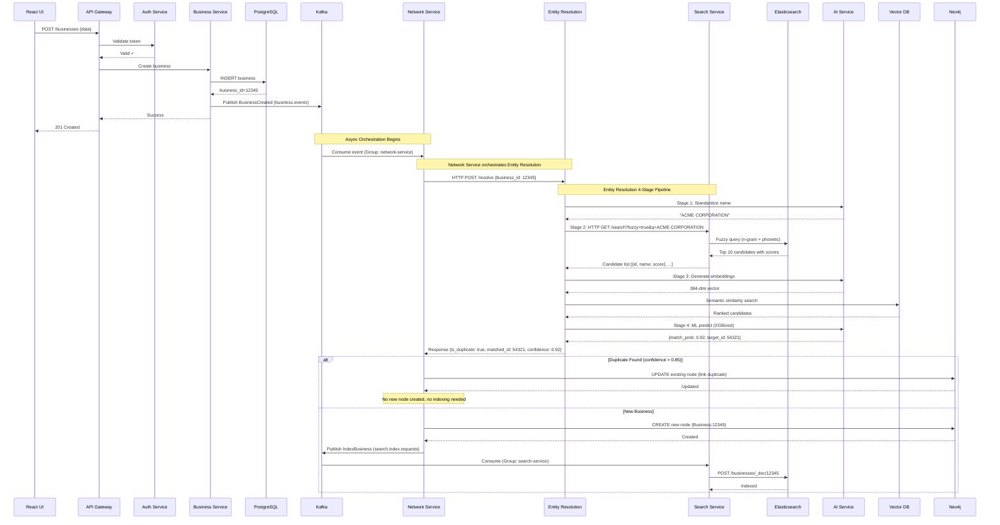
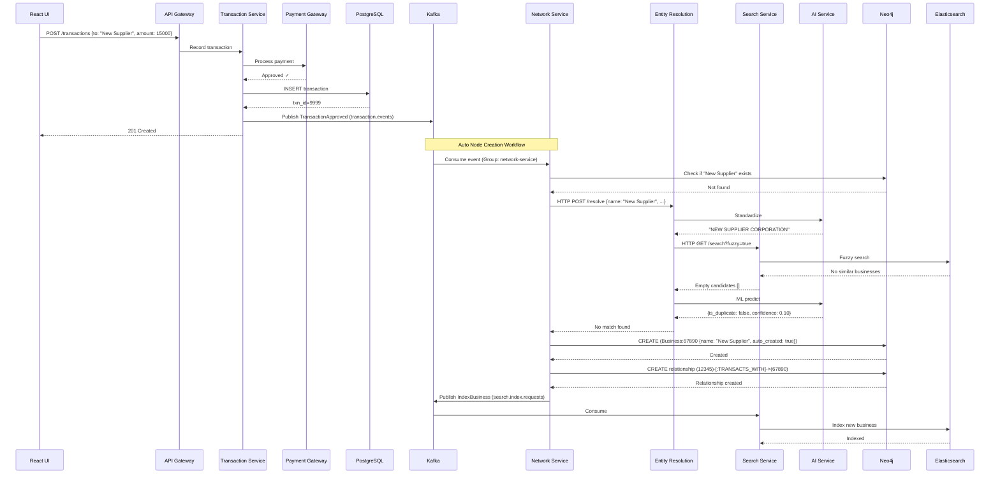
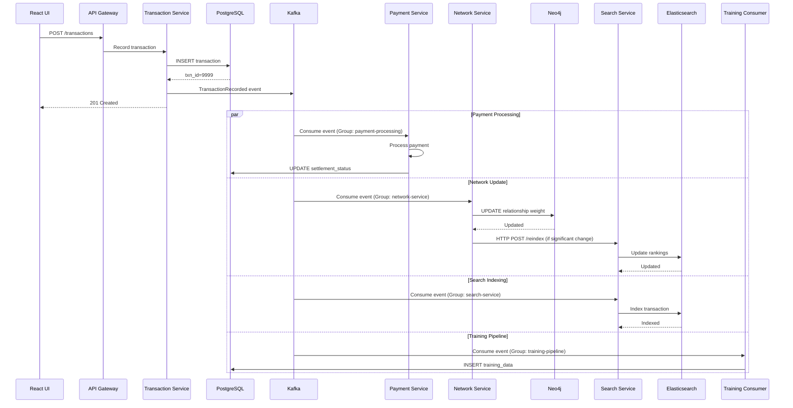
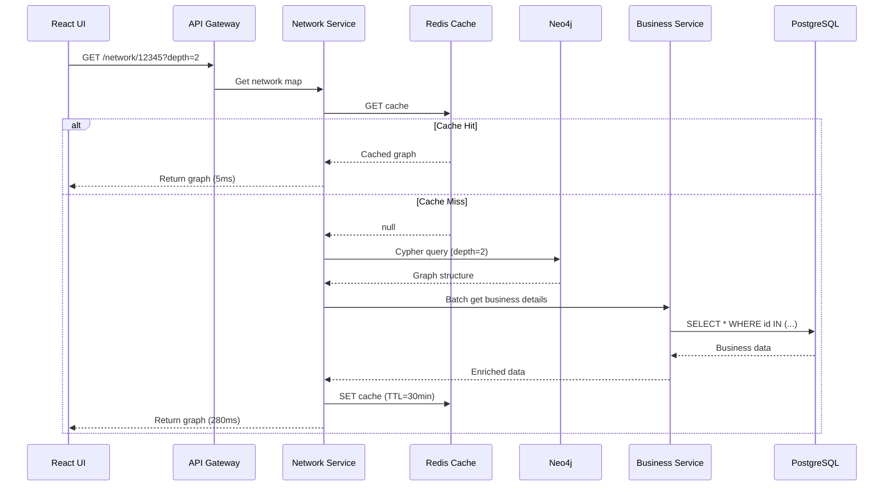
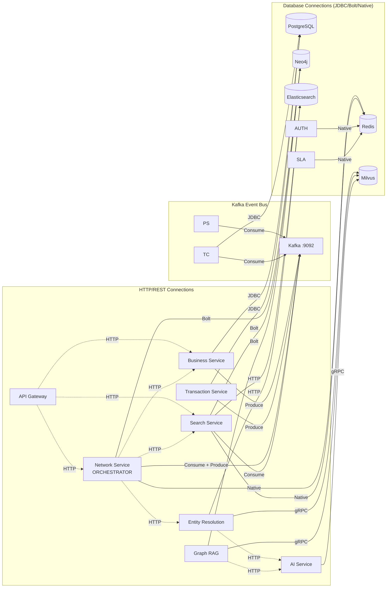

# QuickBooks Business Network - Visual Service Architecture

## High-Level Service Connections Diagram

[Miro](https://miro.com/app/board/uXjVGc_CdZ4=/?share_link_id=443014834206)

```mermaid
graph TB
    subgraph "Client Layer"
        UI[React UI :3000]
    end

    subgraph "Gateway Layer"
        GW[API Gateway :8080]
        AUTH[Auth Service :8092]
    end

    subgraph "Business Logic Layer"
        BS[Business Service :8081]
        TS[Transaction Service :8084]
        PS[Payment Service :8084]
        NS[Network Service :8082<br/>ORCHESTRATOR]
        ER[Entity Resolution :8085]
        SS[Search Service :8083]
        RAG[Graph RAG :8086]
        TC[Training Consumer :8089]
        DG[Data Generator :8090]
        SLA[SLA Metrics :8091]
    end

    subgraph "AI Layer"
        AI[AI Service :8000]
    end

    subgraph "Data Layer"
        PG[(PostgreSQL :5432)]
        NEO[(Neo4j :7687)]
        ES[(Elasticsearch :9200)]
        KAFKA[Kafka :9092]
        REDIS[(Redis :6379)]
        VECTOR[(Vector DB :19530)]
    end

    %% Client to Gateway
    UI -->|HTTPS| GW

    %% Gateway to Services
    GW -->|Auth Check| AUTH
    GW -->|Route Requests| BS
    GW -->|Route Requests| NS
    GW -->|Route Requests| SS
    GW -->|Route Requests| TS
    GW -->|Route Requests| RAG

    %% Business Service Connections
    BS -->|Read/Write| PG
    BS -->|Produce business.events| KAFKA
    BS -->|Cache| REDIS

    %% Transaction Service Connections
    TS -->|Store Transactions| PG
    TS -->|Produce transaction.events| KAFKA

    %% Network Service Connections (ORCHESTRATOR)
    NS -->|Graph Queries| NEO
    NS -->|Cache| REDIS
    NS -->|Consume business/transaction events| KAFKA
    NS -->|Enrich Data| BS
    NS -->|HTTP: Trigger Resolution| ER
    NS -->|Produce search.index.requests| KAFKA

    %% Entity Resolution Connections (KEY: Calls Search Service)
    ER -->|HTTP: Fuzzy Search Matching| SS
    ER -->|ML Inference| AI
    ER -->|Semantic Search| VECTOR

    %% Search Service Connections
    SS -->|Fuzzy Search Queries| ES
    SS -->|Graph Context| NEO
    SS -->|Cache Results| REDIS
    SS -->|Consume search.index.requests| KAFKA
    SS -->|Index New Businesses| ES

    %% Payment Service Connections
    PS -->|Consume transaction.events| KAFKA
    PS -->|Update Status| PG

    %% Graph RAG Connections
    RAG -->|Embeddings| AI
    RAG -->|Vector Search| VECTOR
    RAG -->|Subgraph Query| NEO
    RAG -->|LLM Generate| AI

    %% Training Consumer Connections
    TC -->|Consume Events| KAFKA
    TC -->|Store Training Data| PG
    TC -->|Train Models| AI

    %% AI Service Connections
    AI -->|Update Embeddings| VECTOR

    %% SLA Metrics Connections
    SLA -.->|Scrape Metrics| BS
    SLA -.->|Scrape Metrics| NS
    SLA -.->|Scrape Metrics| SS
    SLA -.->|Scrape Metrics| TS
    SLA -.->|Scrape Metrics| ER
    SLA -->|Store Metrics| REDIS
    SLA -->|Monitor Lag| KAFKA

    %% Data Generator Connections
    DG -->|Generate Test Data| KAFKA
    DG -.->|Verify| PG
    DG -.->|Verify| NEO
    DG -.->|Verify| ES

    %% Auth Service
    AUTH -->|Session Cache| REDIS

    style UI fill:#e1f5ff
    style GW fill:#fff4e1
    style AUTH fill:#fff4e1
    style NS fill:#ffcccc
    style ER fill:#ffe6cc
    style AI fill:#ffe1f5
    style PG fill:#e8f5e9
    style NEO fill:#e8f5e9
    style ES fill:#e8f5e9
    style KAFKA fill:#fff3e0
    style REDIS fill:#e8f5e9
    style VECTOR fill:#e8f5e9
```



## Critical Data Flow: Business Creation → Entity Resolution



## Transaction-Based Auto Node Creation Flow



## Event Flow: Transaction Processing



## Read Path: Network Map Query



## Connection Matrix by Protocol



---

## Architecture Pattern: Orchestration Model

### Why This Architecture?

**Previous Architecture Issues:**
- Entity Resolution consuming directly from Kafka created tight coupling
- No coordination between graph updates and entity matching
- Search Service manually polling for updates
- Difficult to ensure consistency across Neo4j, Elasticsearch, and ML models

**Improved Architecture Benefits:**

1. **Network Service as Orchestrator**
   - Single point of control for graph operations
   - Coordinates entity resolution synchronously
   - Ensures Neo4j is updated before entity matching begins
   - Controls Kafka event flow

2. **Search Service Real-time Indexing**
   - Consumes from Kafka for immediate indexing
   - No polling required
   - Parallel processing with Network Service
   - Independent scaling

3. **Entity Resolution as Stateless Service**
   - HTTP-based (synchronous) invocation
   - No Kafka consumer lag to manage
   - Easier to scale horizontally
   - Network Service controls when/how it's called

### Data Flow Summary

```
Business Created Event Flow:
1. Business Service → Kafka (business.events)
2. Network Service consumes event
   ├─→ Creates Neo4j node
   ├─→ Calls Entity Resolution (HTTP)
   │   └─→ Entity Resolution: Elasticsearch + Milvus + AI Service
   ├─→ If match found: Creates relationship in Neo4j
   ├─→ Publishes match event to Kafka (entity.matches)
   └─→ Invalidates Redis cache
3. Search Service consumes event (parallel)
   └─→ Indexes in Elasticsearch

Transaction Event Flow:
1. Transaction Service → Kafka (transaction.events)
2. Network Service consumes event
   ├─→ Updates relationship weight in Neo4j
   ├─→ If significant change: Calls Search Service (HTTP)
   └─→ Invalidates Redis cache
3. Search Service consumes event (parallel)
   └─→ Indexes transaction in Elasticsearch
4. Payment Service consumes event (parallel)
   └─→ Processes payment
```

### Consumer Groups

| Consumer Group | Topics | Services | Purpose |
|----------------|--------|----------|---------|
| network-service | business.events, transaction.events | Network Service | Orchestration & graph updates |
| search-service | business.events, transaction.events | Search Service | Real-time indexing |
| payment-processing | transaction.events | Payment Service | Payment processing |
| training-pipeline | business.events, entity.matches, user.feedback | Training Consumer | ML training data |

**Total Kafka Consumer Groups**: 4 (down from 5 in previous architecture)
**Entity Resolution**: HTTP-based (no consumer group needed)