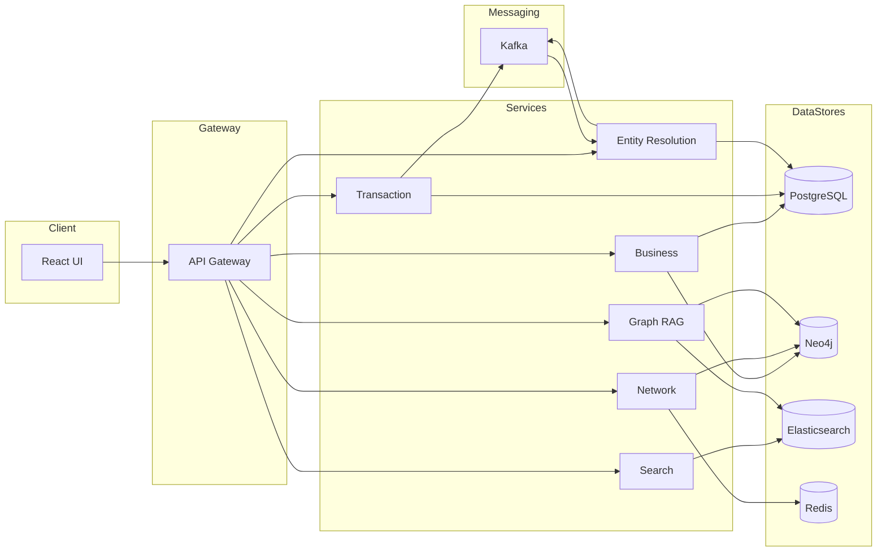
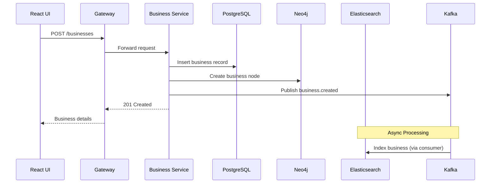
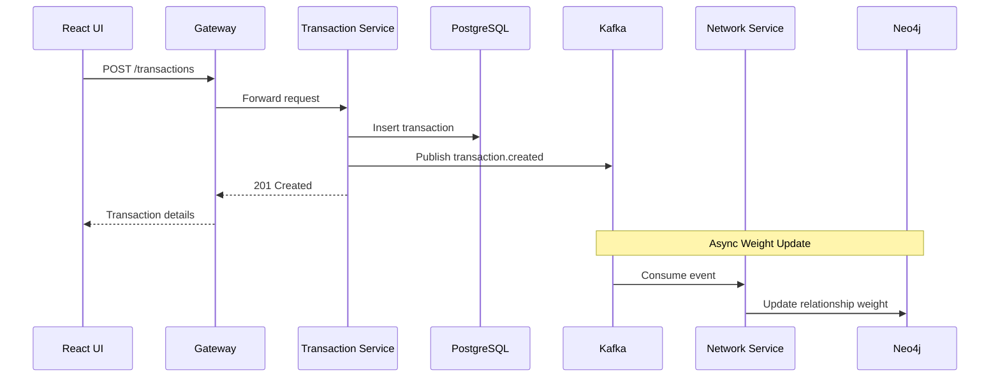
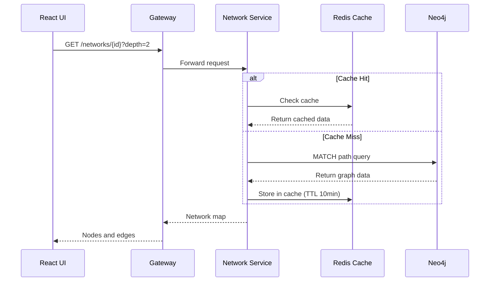
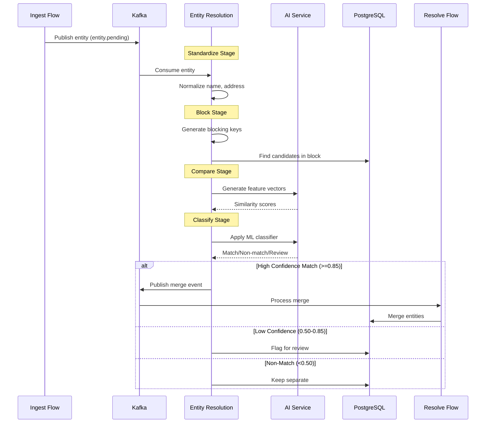
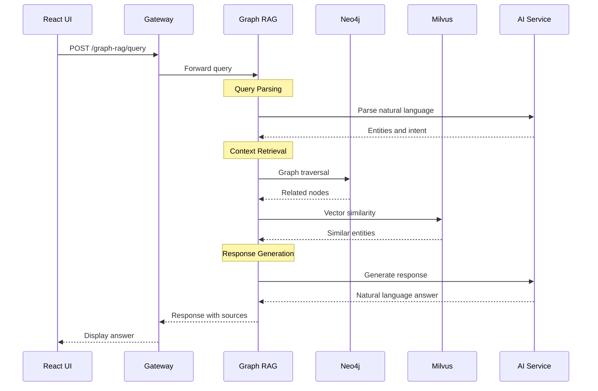
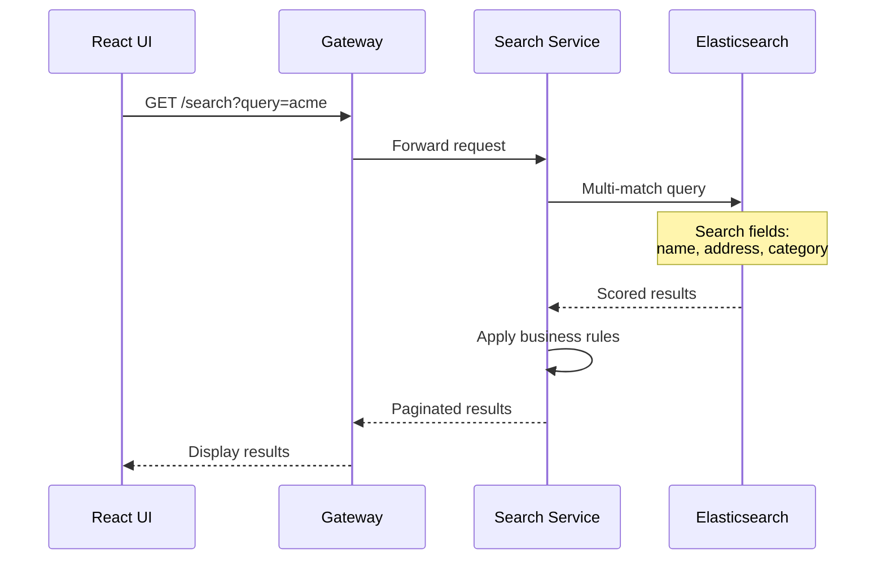

# Data Flow Documentation

## Overview

This document describes the data flow patterns in the QuickBooks Business Network platform.

## High-Level Data Flow

## Flow 1: Business Creation

## Flow 2: Transaction Recording

## Flow 3: Network Visualization

## Flow 4: Entity Resolution Pipeline

## Flow 5: Graph RAG Query

## Flow 6: Search

## Data Consistency Patterns

### Eventually Consistent Flows

- Search indexing (async via Kafka)
- Relationship weight updates (async via Kafka)
- Entity resolution processing (async via Kafka)

### Strongly Consistent Flows

- Business creation (sync to PostgreSQL + Neo4j)
- Transaction recording (sync to PostgreSQL)
- User feedback submission (sync to PostgreSQL)

## Caching Strategy

| Data Type | Cache Location | TTL |
|-----------|----------------|-----|
| Network maps | Redis | 10 minutes |
| Search results | Redis | 5 minutes |
| Business details | Redis | 15 minutes |
| SLA metrics | In-memory | 1 minute |

## Event Topics

| Topic | Producer | Consumer(s) |
|-------|----------|-------------|
| business.created | Business Service | Search, Entity Resolution |
| transaction.created | Transaction Service | Network Service |
| entity.pending | Ingest Flow | Entity Resolution |
| entity.resolved | Entity Resolution | Resolve Flow |
| feedback.received | UI | Training Consumer |
