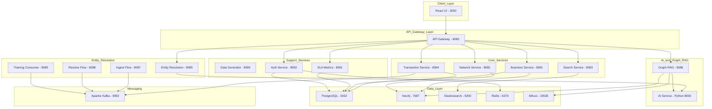

# QuickBooks Business Network - Architecture Overview

## System Overview

The QuickBooks Business Network is a microservices-based platform for managing business-to-business relationships, leveraging advanced entity resolution, graph databases, and AI-powered insights.

## Architecture Diagram

## Service Descriptions

### API Gateway (Port 8080)

- Central entry point for all API requests
- Rate limiting (100 req/min standard, 10 req/min expensive operations)
- CORS configuration
- Correlation ID injection for distributed tracing
- Configurable timeouts per service type

### Business Service (Port 8081)

- CRUD operations for business entities
- Entity validation and deduplication
- Integration with Neo4j for graph storage

### Network Service (Port 8082)

- Network visualization (up to 3-hop depth)
- Relationship management (add/remove/update)
- Export functionality (JSON/CSV)
- Path finding between businesses

### Search Service (Port 8083)

- Full-text search via Elasticsearch
- Fuzzy matching and autocomplete
- Multi-field search (name, address, category)

### Transaction Service (Port 8084)

- Transaction recording and aggregation
- Relationship weight calculation
- Kafka event publishing

### Entity Resolution Service (Port 8085)

- 4-stage pipeline: Standardize -> Block -> Compare -> Classify
- ML-based similarity scoring
- Configurable thresholds (>=0.85 match, 0.50-0.85 review)

### Graph RAG Service (Port 8086)

- Natural language query processing
- Graph traversal context extraction
- Vector similarity search
- LLM response generation

### SLA Metrics Service (Port 8091)

- Percentile calculations (p50, p75, p90, p95, p99)
- Alert generation for threshold breaches
- API performance monitoring

## Data Flow

### Transaction Processing

1. Transaction received via API
2. Validated and stored in PostgreSQL
3. Event published to Kafka
4. Network Service updates relationship weights
5. Neo4j graph updated

### Entity Resolution

1. New entity ingested via Ingest Flow
2. Standardize stage normalizes data
3. Block stage groups potential matches
4. Compare stage generates feature vectors
5. Classify stage applies ML classification
6. Results sent for review or auto-merged

### Graph RAG Queries

1. User submits natural language query
2. Query parsed for entities and intent
3. Graph traversal extracts relevant context
4. Vector similarity adds semantic matches
5. LLM generates comprehensive response

## Key Technologies

| Component | Technology |
|-----------|------------|
| Backend | Java 17, Spring Boot 3.2.x |
| Frontend | React 18, TypeScript |
| Graph DB | Neo4j 5.x |
| Search | Elasticsearch 8.11.x |
| Messaging | Apache Kafka 3.6.x |
| Caching | Redis 7.x |
| Vector DB | Milvus |
| AI Service | Python 3.11, FastAPI |
| Container | Docker, Docker Compose |
| Test Data | Automated generation of complex topologies (Hub/Spoke) |

## Security Considerations

- OAuth2 authentication via Auth Service
- HTTPS/TLS for all communications
- API rate limiting to prevent abuse
- Input validation on all endpoints
- Audit logging for all operations
- No secrets in version control
