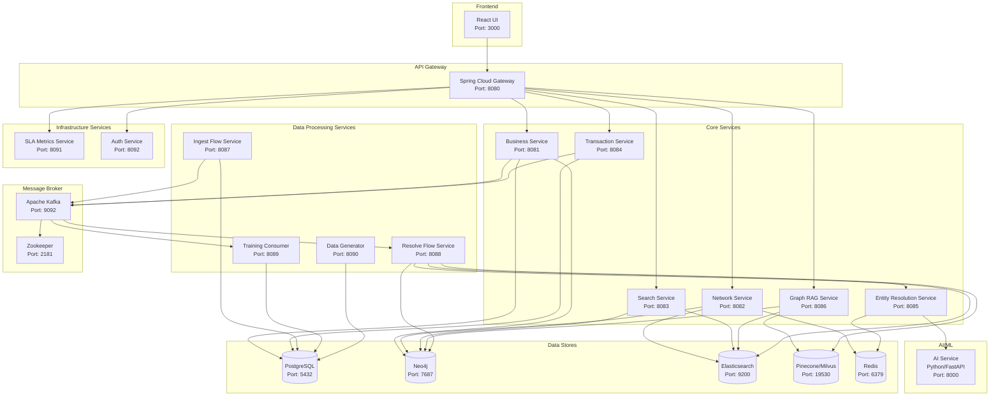
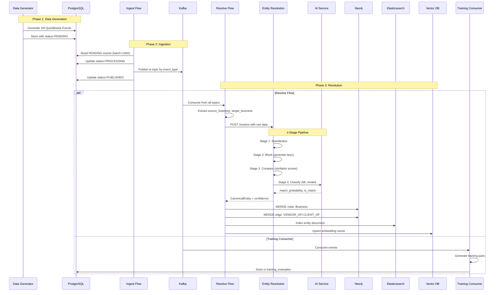
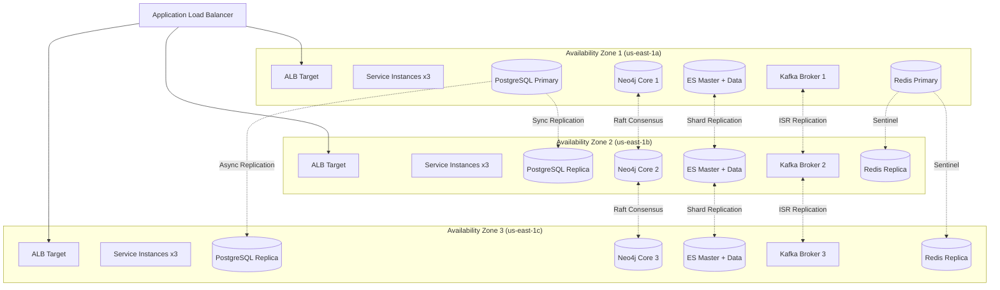
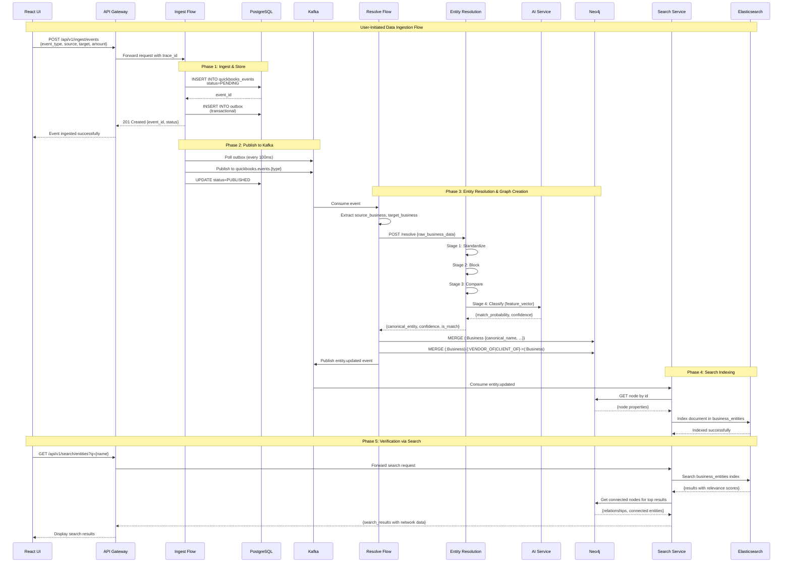

# Design Document: QuickBooks Business Network

## Overview

The QuickBooks Business Network is a comprehensive system for mapping, visualizing, and navigating business relationship graphs. It enables users to understand vendor-client connections, discover relationships, and expand business networks within a scale of up to 1 million businesses and 10 million monthly searches.

The system employs a modern event-driven architecture with:
- **Ingest Flow**: Captures QuickBooks events into PostgreSQL and publishes to Kafka
- **Resolve Flow**: Transforms messy business data into clean Canonical Entities using AI-powered Entity Resolution
- **Graph Database (Neo4j)**: Stores deduplicated entities and relationships for efficient traversal
- **Elasticsearch**: Provides fast text-based entity search
- **Vector Database (Pinecone/Milvus)**: Enables semantic search for Graph RAG queries
- **Graph RAG Service**: Answers natural language questions about business networks

## Architecture

### High-Level Architecture Diagram



### Data Flow Diagram



### Multi-AZ Deployment Architecture



## Components and Interfaces

### 1. API Gateway Service

**Purpose**: Single entry point for all client requests, handles routing, authentication, rate limiting, and CORS.

**Port**: 8080

**Dependencies**: Auth Service, All downstream services

**Configuration**:
```yaml
# application.yml
spring:
  cloud:
    gateway:
      routes:
        - id: business-service
          uri: lb://business-service
          predicates:
            - Path=/api/v1/businesses/**
        - id: network-service
          uri: lb://network-service
          predicates:
            - Path=/api/v1/networks/**
        - id: search-service
          uri: lb://search-service
          predicates:
            - Path=/api/v1/search/**
        - id: graph-rag-service
          uri: lb://graph-rag-service
          predicates:
            - Path=/api/v1/graph-rag/**
```

**Interfaces**:
```
GET  /actuator/health              → Health check
GET  /actuator/ready               → Readiness check
GET  /actuator/metrics             → Prometheus metrics
ANY  /api/v1/**                    → Route to downstream services
```

### 2. Business Service

**Purpose**: Manages Business Entity CRUD operations and user session simulation for POC.

**Port**: 8081

**Dependencies**: PostgreSQL, Neo4j, Kafka, Redis

**Package Structure**:
```
com.quickbooks.business/
├── controller/
│   └── BusinessController.java
├── service/
│   └── BusinessService.java
├── repository/
│   ├── BusinessJpaRepository.java      # PostgreSQL
│   └── BusinessNeo4jRepository.java    # Neo4j
├── model/
│   ├── entity/
│   │   ├── BusinessEntity.java
│   │   └── BusinessNode.java
│   └── dto/
│       ├── BusinessRequest.java
│       └── BusinessResponse.java
├── mapper/
│   └── BusinessMapper.java
├── exception/
│   └── BusinessNotFoundException.java
└── config/
    └── BusinessConfig.java
```

**REST Endpoints**:
```
GET    /api/v1/businesses                        → List all businesses (paginated)
       Query: page=0, size=20, sort=name,asc
       Response: Page<BusinessResponse>

GET    /api/v1/businesses/{id}                   → Get business by ID
       Response: BusinessResponse

POST   /api/v1/businesses                        → Create new business
       Request: BusinessRequest {name, category, address}
       Response: BusinessResponse (201 Created)

PUT    /api/v1/businesses/{id}                   → Update business
       Request: BusinessRequest
       Response: BusinessResponse

DELETE /api/v1/businesses/{id}                   → Delete business
       Response: 204 No Content

POST   /api/v1/businesses/{id}/simulate-session  → POC: Simulate user session
       Response: SessionResponse {session_id, business_id}
```

### 3. Network Service

**Purpose**: Manages business relationships and network visualization.

**Port**: 8082

**Dependencies**: Neo4j, Elasticsearch, Redis

**Package Structure**:
```
com.quickbooks.network/
├── controller/
│   ├── NetworkController.java
│   └── ExportController.java
├── service/
│   ├── NetworkService.java
│   ├── RelationshipService.java
│   ├── PathfindingService.java
│   └── ExportService.java
├── repository/
│   └── RelationshipNeo4jRepository.java
├── model/
│   ├── entity/
│   │   └── RelationshipEdge.java
│   └── dto/
│       ├── NetworkMapResponse.java
│       ├── RelationshipRequest.java
│       └── ExportRequest.java
└── algorithm/
    └── BreadthFirstSearch.java
```

**REST Endpoints**:
```
GET    /api/v1/networks/{businessId}/map
       Query: depth=1 (default), include_weights=true
       Response: NetworkMapResponse {nodes[], edges[]}

GET    /api/v1/networks/{businessId}/relationships
       Query: type=VENDOR|CLIENT|ALL (default)
       Response: List<RelationshipResponse>

POST   /api/v1/networks/{businessId}/relationships
       Request: RelationshipRequest {target_business_id, type}
       Response: RelationshipResponse (201 Created)

DELETE /api/v1/networks/{businessId}/relationships/{relationshipId}
       Query: confirm=true (required)
       Response: 204 No Content

GET    /api/v1/networks/{businessId}/indirect
       Query: max_depth=3 (default, max=3)
       Response: IndirectRelationshipsResponse {paths[]}

GET    /api/v1/networks/{businessId}/path/{targetId}
       Response: PathResponse {nodes[], total_hops}

POST   /api/v1/networks/export
       Request: ExportRequest {business_id, format=JSON|CSV}
       Response: StreamingResponseBody (file download)
```

### 4. Search Service

**Purpose**: Provides entity search via Elasticsearch and graph traversal via Neo4j.

**Port**: 8083

**Dependencies**: Elasticsearch, Neo4j, Redis

**Package Structure**:
```
com.quickbooks.search/
├── controller/
│   └── SearchController.java
├── service/
│   ├── SearchService.java
│   ├── ElasticsearchService.java
│   └── GraphTraversalService.java
├── repository/
│   └── BusinessElasticsearchRepository.java
├── model/
│   ├── document/
│   │   └── BusinessDocument.java
│   └── dto/
│       ├── SearchRequest.java
│       └── SearchResponse.java
├── analyzer/
│   └── BusinessNameAnalyzer.java
└── index/
    └── BusinessIndexMapping.java
```

**Elasticsearch Index Mapping**:
```json
{
  "settings": {
    "analysis": {
      "analyzer": {
        "business_name_analyzer": {
          "type": "custom",
          "tokenizer": "standard",
          "filter": ["lowercase", "asciifolding", "business_ngram"]
        }
      },
      "filter": {
        "business_ngram": {
          "type": "ngram",
          "min_gram": 3,
          "max_gram": 10
        }
      }
    }
  },
  "mappings": {
    "properties": {
      "id": {"type": "keyword"},
      "canonical_name": {"type": "text", "analyzer": "business_name_analyzer"},
      "raw_name": {"type": "text"},
      "category": {"type": "keyword"},
      "state": {"type": "keyword"},
      "city": {"type": "keyword"},
      "aliases": {"type": "text"},
      "created_at": {"type": "date"},
      "updated_at": {"type": "date"}
    }
  }
}
```

**REST Endpoints**:
```
GET  /api/v1/search/entities
     Query: q={query}, type=VENDOR|CLIENT, category={cat}, state={st}
     Query: page=0, size=20
     Response: SearchResponse {results[], total_hits, took_ms}

GET  /api/v1/search/entities/{entityId}/connected
     Query: depth=3 (default, max=3)
     Query: type=VENDOR|CLIENT, min_volume={decimal}, max_volume={decimal}
     Response: ConnectedNodesResponse {nodes[], edges[]}

GET  /api/v1/search/suggestions
     Query: prefix={text}
     Response: List<SuggestionResponse> (autocomplete)
```

### 5. Transaction Service

**Purpose**: Manages transaction volumes and relationship weight updates.

**Port**: 8084

**Dependencies**: PostgreSQL, Kafka, Neo4j

**Package Structure**:
```
com.quickbooks.transaction/
├── controller/
│   └── TransactionController.java
├── service/
│   ├── TransactionService.java
│   └── WeightCalculationService.java
├── repository/
│   └── TransactionJpaRepository.java
├── model/
│   ├── entity/
│   │   └── Transaction.java
│   └── dto/
│       ├── TransactionRequest.java
│       └── TransactionResponse.java
└── event/
    └── TransactionEventPublisher.java
```

**REST Endpoints**:
```
POST /api/v1/transactions
     Request: TransactionRequest {source_id, target_id, amount, type}
     Response: TransactionResponse (201 Created)

GET  /api/v1/transactions
     Query: business_id={id}, start_date={date}, end_date={date}
     Query: page=0, size=50
     Response: Page<TransactionResponse>

GET  /api/v1/transactions/{id}
     Response: TransactionResponse

GET  /api/v1/relationships/{relationshipId}/weight
     Response: WeightResponse {relationship_id, weight, transaction_count}

PUT  /api/v1/relationships/{relationshipId}/weight/recalculate
     Response: WeightResponse (triggers recalculation)
```

### 6. Entity Resolution Service

**Purpose**: Four-stage process (Standardize, Block, Compare, Classify) for entity matching.

**Port**: 8085

**Dependencies**: AI Service (Python), Redis (caching), PostgreSQL (training data)

**Package Structure**:
```
com.quickbooks.entityresolution/
├── controller/
│   ├── EntityResolutionController.java
│   └── FeedbackController.java
├── service/
│   ├── EntityResolutionService.java
│   ├── EntityResolutionPipeline.java
│   └── FeedbackService.java
├── stage/
│   ├── StandardizeStage.java
│   ├── BlockStage.java
│   ├── CompareStage.java
│   └── ClassifyStage.java
├── algorithm/
│   ├── LevenshteinDistance.java
│   ├── JaroWinklerSimilarity.java
│   └── TokenSortRatio.java
├── model/
│   ├── RawBusinessData.java
│   ├── StandardizedEntity.java
│   ├── BlockingKey.java
│   ├── FeatureVector.java
│   ├── ClassificationResult.java
│   └── EntityResolutionResult.java
├── client/
│   └── AIServiceClient.java
└── config/
    ├── AbbreviationConfig.java
    └── ThresholdConfig.java
```

**Abbreviation Mappings**:
```java
public static final Map<String, String> NAME_ABBREVIATIONS = Map.of(
    "corp", "corporation",
    "inc", "incorporated",
    "ltd", "limited",
    "llc", "limited liability company",
    "co", "company",
    "intl", "international"
);

public static final Map<String, String> ADDRESS_ABBREVIATIONS = Map.ofEntries(
    Map.entry("st", "street"),
    Map.entry("ave", "avenue"),
    Map.entry("blvd", "boulevard"),
    Map.entry("rd", "road"),
    Map.entry("dr", "drive"),
    Map.entry("ln", "lane"),
    Map.entry("ct", "court"),
    Map.entry("n", "north"),
    Map.entry("s", "south"),
    Map.entry("e", "east"),
    Map.entry("w", "west"),
    Map.entry("apt", "apartment"),
    Map.entry("ste", "suite")
);
```

**REST Endpoints**:
```
POST /api/v1/entity-resolution/resolve
     Request: RawBusinessData {name, address, category}
     Response: EntityResolutionResult {
       canonical_entity: CanonicalEntity,
       confidence: 0.0-1.0,
       is_match: boolean,
       matched_entity_id: string|null,
       requires_review: boolean,
       processing_time_ms: long
     }

POST /api/v1/entity-resolution/batch-resolve
     Request: List<RawBusinessData> (max 100)
     Response: List<EntityResolutionResult>

POST /api/v1/entity-resolution/feedback/false-positive
     Request: FeedbackRequest {entity_a_id, entity_b_id, comment}
     Response: 201 Created

POST /api/v1/entity-resolution/feedback/false-negative
     Request: FeedbackRequest {entity_a_id, entity_b_id, comment}
     Response: 201 Created

GET  /api/v1/entity-resolution/metrics
     Response: MetricsResponse {
       total_resolved: long,
       accuracy: double,
       false_positive_rate: double,
       false_negative_rate: double,
       avg_processing_time_ms: double
     }
```

### 7. Graph RAG Service

**Purpose**: Natural language query processing using vector and graph databases.

**Port**: 8086

**Dependencies**: Vector DB (Pinecone/Milvus), Neo4j, Elasticsearch

**Package Structure**:
```
com.quickbooks.graphrag/
├── controller/
│   └── GraphRAGController.java
├── service/
│   ├── GraphRAGService.java
│   ├── QueryParserService.java
│   ├── VectorSearchService.java
│   └── GraphTraversalService.java
├── parser/
│   ├── NaturalLanguageParser.java
│   ├── IntentExtractor.java
│   ├── EntityExtractor.java
│   └── FilterExtractor.java
├── model/
│   ├── ParsedQuery.java
│   ├── GraphRAGRequest.java
│   ├── GraphRAGResponse.java
│   └── RankedResult.java
├── ranking/
│   └── HybridRankingService.java
└── client/
    ├── VectorDBClient.java
    └── Neo4jClient.java
```

**REST Endpoints** (NO WebSocket):
```
POST /api/v1/graph-rag/query
     Request: {
       "query": "flower businesses in Texas connected to me offering discounts",
       "user_id": "business-123",
       "max_depth": 3,
       "max_results": 20
     }
     Response: {
       "results": [
         {
           "business_id": "...",
           "canonical_name": "...",
           "category": "flower",
           "state": "TX",
           "offers_discounts": true,
           "semantic_similarity": 0.89,
           "graph_connectivity": 0.75,
           "combined_score": 0.83,
           "path_to_user": ["...", "...", "..."]
         }
       ],
       "total_results": 15,
       "confidence": 0.92,
       "query_interpretation": {
         "intent": "search",
         "entities": ["flower"],
         "filters": {"state": "TX", "offers_discounts": true},
         "relationship": "connected",
         "max_depth": 3
       },
       "suggestions": [],
       "explanation": "Found 15 flower businesses in Texas within 3 hops that offer discounts.",
       "processing_time_ms": 342
     }

GET  /api/v1/graph-rag/suggestions
     Query: partial_query={text}
     Response: List<String> (query suggestions)
```

### 8. Ingest Flow Service

**Purpose**: Receives QuickBooks events, stores in PostgreSQL, publishes to Kafka.

**Port**: 8087

**Dependencies**: PostgreSQL, Kafka

**Package Structure**:
```
com.quickbooks.ingest/
├── controller/
│   └── IngestController.java
├── service/
│   ├── IngestService.java
│   └── OutboxService.java
├── repository/
│   ├── QuickBooksEventRepository.java
│   └── OutboxRepository.java
├── model/
│   ├── entity/
│   │   ├── QuickBooksEvent.java
│   │   └── OutboxEntry.java
│   └── dto/
│       └── IngestResponse.java
├── publisher/
│   └── KafkaEventPublisher.java
└── scheduler/
    └── OutboxPollingScheduler.java
```

**Kafka Topics**:
```
quickbooks.events.invoice    → Invoice events
quickbooks.events.payment    → Payment events
quickbooks.events.vendor     → Vendor add/update events
quickbooks.events.customer   → Customer add/update events
```

**Transactional Outbox Pattern**:
```java
@Transactional
public void ingest(QuickBooksEvent event) {
    // 1. Store event in PostgreSQL
    event.setStatus(ProcessingStatus.PENDING);
    eventRepository.save(event);
    
    // 2. Store in outbox table (same transaction)
    OutboxEntry outbox = new OutboxEntry(event.getId(), event.getType(), serialize(event));
    outboxRepository.save(outbox);
    
    // 3. Scheduler polls outbox, publishes to Kafka, marks as PUBLISHED
}
```

**REST Endpoints**:
```
POST /api/v1/ingest/events
     Request: QuickBooksEvent {type, source_business_raw, target_business_raw, amount, metadata}
     Response: IngestResponse {event_id, status}

POST /api/v1/ingest/events/batch
     Request: List<QuickBooksEvent> (max 1000)
     Response: BatchIngestResponse {success_count, failure_count, event_ids[]}

GET  /api/v1/ingest/events/{id}/status
     Response: EventStatusResponse {id, status, kafka_topic, published_at}
```

### 9. Resolve Flow Service

**Purpose**: Consumes Kafka events, resolves entities, persists to Neo4j and Elasticsearch.

**Port**: 8088

**Dependencies**: Kafka, Entity Resolution Service, Neo4j, Elasticsearch, Vector DB

**Package Structure**:
```
com.quickbooks.resolve/
├── consumer/
│   └── QuickBooksEventConsumer.java
├── service/
│   ├── ResolveFlowService.java
│   ├── EntityExtractor.java
│   └── MergeService.java
├── client/
│   ├── EntityResolutionClient.java
│   ├── Neo4jClient.java
│   ├── ElasticsearchClient.java
│   └── VectorDBClient.java
├── model/
│   └── ResolvedEntity.java
└── config/
    └── KafkaConsumerConfig.java
```

**Kafka Consumer Configuration**:
```yaml
spring:
  kafka:
    consumer:
      group-id: resolve-flow-consumer-group
      auto-offset-reset: earliest
      enable-auto-commit: false
      max-poll-records: 100
    listener:
      ack-mode: manual
      concurrency: 3
```

### 10. Training Consumer Service

**Purpose**: Generates training data from Kafka events for Entity Resolution model improvement.

**Port**: 8089

**Dependencies**: Kafka, PostgreSQL

**Package Structure**:
```
com.quickbooks.training/
├── consumer/
│   └── TrainingDataConsumer.java
├── service/
│   ├── TrainingDataService.java
│   ├── PairGeneratorService.java
│   └── FeedbackIncorporationService.java
├── repository/
│   └── TrainingExampleRepository.java
├── model/
│   ├── entity/
│   │   └── TrainingExample.java
│   └── dto/
│       └── TrainingPair.java
└── config/
    └── KafkaConsumerConfig.java
```

### 11. Data Generator Service

**Purpose**: Creates realistic test data for POC with messy business names and transactions.

**Port**: 8090

**Dependencies**: PostgreSQL

**Package Structure**:
```
com.quickbooks.datagenerator/
├── controller/
│   └── DataGeneratorController.java
├── service/
│   ├── DataGeneratorService.java
│   ├── BusinessGenerator.java
│   ├── EventGenerator.java
│   └── MessinessInjector.java
├── model/
│   ├── GeneratorConfig.java
│   └── GeneratorStatus.java
├── data/
│   ├── business_names.txt
│   ├── street_names.txt
│   ├── cities.txt
│   └── categories.txt
└── repository/
    └── GeneratedEventRepository.java
```

**Messiness Injection Rules**:
```java
public class MessinessInjector {
    // 30% of records: Introduce typos
    // - Swap adjacent characters
    // - Double a character
    // - Drop a character
    
    // 40% of records: Use abbreviations
    // - "Corporation" → "Corp" or "Corp." or "CORP"
    // - "Street" → "St" or "St."
    
    // 50% of records: Inconsistent capitalization
    // - "ACME Corp" or "acme corp" or "Acme CORP"
    
    // Power-law distribution for event assignment
    // - 20% of businesses receive 80% of events
}
```

**REST Endpoints**:
```
POST /api/v1/data-generator/generate
     Request: GeneratorConfig {
       business_count: 10000,
       event_count: 1000000,
       messiness_level: "high"|"medium"|"low"
     }
     Response: GeneratorStatus {job_id, status}

GET  /api/v1/data-generator/status/{jobId}
     Response: GeneratorStatus {job_id, status, progress_percent, businesses_created, events_created}

POST /api/v1/data-generator/reset
     Response: 204 No Content (clears all generated data)
```

### 12. SLA Metrics Service

**Purpose**: Tracks and reports API performance metrics.

**Port**: 8091

**Dependencies**: PostgreSQL (metrics storage), All services (via Micrometer)

**Package Structure**:
```
com.quickbooks.slametrics/
├── controller/
│   └── SLAMetricsController.java
├── service/
│   ├── MetricsCollectionService.java
│   ├── PercentileCalculationService.java
│   └── AlertService.java
├── repository/
│   └── MetricsRepository.java
├── model/
│   ├── entity/
│   │   └── MetricRecord.java
│   └── dto/
│       ├── SLAMetricsResponse.java
│       └── AlertResponse.java
└── config/
    └── MicrometerConfig.java
```

**REST Endpoints**:
```
GET /api/v1/metrics/sla
    Response: SLAMetricsResponse {
      endpoints: [
        {
          endpoint: "/api/v1/search/entities",
          p50_ms: 45,
          p75_ms: 78,
          p90_ms: 120,
          p95_ms: 180,
          p99_ms: 350,
          success_rate: 0.998,
          error_rate: 0.002,
          requests_per_minute: 500
        }
      ],
      overall: {...},
      sla_status: "MEETING"|"WARNING"|"BREACHING"
    }

GET /api/v1/metrics/sla/{endpoint}
    Response: EndpointMetricsResponse (detailed for single endpoint)

GET /api/v1/metrics/alerts
    Query: severity=CRITICAL|WARNING|INFO, start_date, end_date
    Response: List<AlertResponse>
```

## Data Models

### Core Entities

```java
/**
 * Canonical Entity (Neo4j Node)
 * Label: :Business
 */
@Node("Business")
public class CanonicalEntity {
    @Id
    private String id;                      // UUID
    
    @Property("canonical_name")
    private String canonicalName;           // Standardized name
    
    @Property("raw_name")
    private String rawName;                 // Original messy name
    
    @Property("category")
    private String category;                // Business category
    
    @Property("address_street")
    private String addressStreet;
    
    @Property("address_city")
    private String addressCity;
    
    @Property("address_state")
    private String addressState;            // 2-letter code
    
    @Property("address_zip")
    private String addressZip;              // 5 digits
    
    @Property("aliases")
    private List<String> aliases;           // Alternative names
    
    @Property("offers_discounts")
    private Boolean offersDiscounts;        // Graph RAG attribute
    
    @Property("created_at")
    private LocalDateTime createdAt;
    
    @Property("updated_at")
    private LocalDateTime updatedAt;
    
    @Property("confidence_score")
    private Double confidenceScore;         // Entity resolution confidence
}

/**
 * Relationship (Neo4j Edge)
 * Types: :VENDOR_OF, :CLIENT_OF
 */
@RelationshipProperties
public class Relationship {
    @Id
    private String id;                      // UUID
    
    @TargetNode
    private CanonicalEntity target;
    
    @Property("transaction_volume")
    private BigDecimal transactionVolume;   // Aggregate transaction amount
    
    @Property("weight")
    private Double weight;                  // Normalized weight (0.0-1.0)
    
    @Property("transaction_count")
    private Integer transactionCount;
    
    @Property("created_at")
    private LocalDateTime createdAt;
    
    @Property("last_transaction_at")
    private LocalDateTime lastTransactionAt;
}

/**
 * QuickBooks Event (PostgreSQL)
 * Table: quickbooks_events
 */
@Entity
@Table(name = "quickbooks_events")
public class QuickBooksEvent {
    @Id
    private String id;                      // UUID
    
    @Enumerated(EnumType.STRING)
    @Column(name = "event_type")
    private EventType type;                 // INVOICE, PAYMENT, VENDOR_ADD, CUSTOMER_ADD
    
    @Column(name = "source_business_raw", columnDefinition = "TEXT")
    private String sourceBusinessRaw;       // Messy source business data (JSON)
    
    @Column(name = "target_business_raw", columnDefinition = "TEXT")
    private String targetBusinessRaw;       // Messy target business data (JSON)
    
    @Column(precision = 15, scale = 2)
    private BigDecimal amount;
    
    @Column(columnDefinition = "JSONB")
    private String metadata;
    
    @Column(name = "event_timestamp")
    private LocalDateTime eventTimestamp;
    
    @Column(name = "ingested_at")
    private LocalDateTime ingestedAt;
    
    @Enumerated(EnumType.STRING)
    private ProcessingStatus status;        // PENDING, PROCESSING, PUBLISHED, FAILED
}

/**
 * Training Example (PostgreSQL)
 * Table: training_examples
 */
@Entity
@Table(name = "training_examples")
public class TrainingExample {
    @Id
    private String id;                      // UUID
    
    @Column(name = "entity_a_raw", columnDefinition = "TEXT")
    private String entityARaw;
    
    @Column(name = "entity_b_raw", columnDefinition = "TEXT")
    private String entityBRaw;
    
    @Enumerated(EnumType.STRING)
    private TrainingLabel label;            // MATCH, NON_MATCH, UNCERTAIN
    
    @Column(name = "feature_vector", columnDefinition = "JSONB")
    private String featureVector;           // 7-feature JSON array
    
    @Enumerated(EnumType.STRING)
    private DataSource source;              // AUTOMATED, USER_FEEDBACK
    
    private Double confidence;
    
    @Column(name = "created_at")
    private LocalDateTime createdAt;
}

/**
 * User Feedback (PostgreSQL)
 * Table: user_feedback
 */
@Entity
@Table(name = "user_feedback")
public class UserFeedback {
    @Id
    private String id;                      // UUID
    
    @Column(name = "entity_a_id")
    private String entityAId;
    
    @Column(name = "entity_b_id")
    private String entityBId;
    
    @Enumerated(EnumType.STRING)
    @Column(name = "feedback_type")
    private FeedbackType type;              // FALSE_POSITIVE, FALSE_NEGATIVE
    
    @Column(name = "user_id")
    private String userId;
    
    @Column(columnDefinition = "TEXT")
    private String comment;
    
    @Column(name = "submitted_at")
    private LocalDateTime submittedAt;
    
    @Enumerated(EnumType.STRING)
    private FeedbackStatus status;          // PENDING, PROCESSED, REJECTED
}

/**
 * Audit Log (PostgreSQL - Immutable)
 * Table: audit_log
 */
@Entity
@Table(name = "audit_log")
public class AuditLog {
    @Id
    private String id;                      // UUID
    
    private LocalDateTime timestamp;
    
    @Enumerated(EnumType.STRING)
    private AuditAction action;             // CREATE, UPDATE, DELETE, MERGE
    
    @Column(name = "entity_type")
    private String entityType;              // Business, Relationship, etc.
    
    @Column(name = "entity_id")
    private String entityId;
    
    @Column(name = "user_id")
    private String userId;
    
    @Column(name = "before_state", columnDefinition = "JSONB")
    private String beforeState;
    
    @Column(name = "after_state", columnDefinition = "JSONB")
    private String afterState;
    
    @Column(name = "correlation_id")
    private String correlationId;
}
```

### Entity Resolution Data Models

```java
/**
 * Standardized Entity (after Standardize stage)
 */
public class StandardizedEntity {
    private String rawName;
    private String standardizedName;        // lowercase, expanded abbreviations
    private String legalEntityType;         // LLC, CORP, INC, etc. (extracted)
    private StandardizedAddress address;
    private String category;
    private List<String> tokens;            // Name tokens for comparison
}

/**
 * Blocking Key (for Block stage)
 */
public class BlockingKey {
    private String namePrefix;              // First 3 chars of standardized name
    private String state;                   // 2-letter state code
    private String category;                // Business category
    private String compositeKey;            // namePrefix + "-" + state
}

/**
 * Feature Vector (after Compare stage)
 * 7 features for ML classification
 */
public class FeatureVector {
    private double levenshteinScore;        // 0.0-1.0 (1 - normalized distance)
    private double jaroWinklerScore;        // 0.0-1.0
    private double tokenSimilarity;         // 0.0-1.0 (token sort ratio)
    private double addressSimilarity;       // 0.0-1.0 (weighted components)
    private double categoryMatch;           // 0.0 or 1.0
    private double sameLegalType;           // 0.0 or 1.0
    private double sameState;               // 0.0 or 1.0
    
    public double[] toArray() {
        return new double[] {
            levenshteinScore, jaroWinklerScore, tokenSimilarity,
            addressSimilarity, categoryMatch, sameLegalType, sameState
        };
    }
}

/**
 * Classification Result (after Classify stage)
 */
public class ClassificationResult {
    private double matchProbability;        // 0.0-1.0 from ML model
    private boolean isMatch;                // matchProbability >= 0.85
    private double confidence;              // Model confidence
    private boolean requiresReview;         // 0.50 <= matchProbability < 0.85
}

/**
 * Complete Entity Resolution Result
 */
public class EntityResolutionResult {
    private CanonicalEntity canonicalEntity;
    private ClassificationResult classification;
    private String matchedEntityId;         // If matched to existing entity
    private long processingTimeMs;
    private Map<String, Object> debugInfo;  // Stage timings, intermediate results
}
```

### Vector Embedding Model

```java
/**
 * Entity Embedding (Vector DB)
 */
public class EntityEmbedding {
    private String entityId;                // References Neo4j node ID
    private float[] vector;                 // 768-dimensional embedding
    private Map<String, Object> metadata;   // Searchable attributes
    private LocalDateTime updatedAt;
}
```

## Correctness Properties

Properties define behaviors that must hold across all valid system executions. These bridge requirements to testable invariants.

### Property 1: Network Map Retrieval Completeness
*For any* Business Entity with N direct relationships in Neo4j, when the network map is requested, the system SHALL return exactly N relationships with no omissions or duplicates.
**Validates: Requirements 1.1, 2.3**

### Property 2: Search Results Completeness
*For any* search query Q and set of Business Entities, all entities whose canonical_name contains Q (case-insensitive) SHALL be included in the search results.
**Validates: Requirements 2.1**

### Property 3: Relationship Type Filtering
*For any* relationship type filter T ∈ {VENDOR, CLIENT} and set of relationships R, the filtered results SHALL contain only relationships where type = T.
**Validates: Requirements 2.2**

### Property 4: Indirect Relationship Boundary
*For any* Business Entity in the graph, the computed indirect relationships SHALL include all entities reachable within exactly 1, 2, or 3 hops (as specified), and SHALL NOT include any entities beyond the specified depth.
**Validates: Requirements 2.4, 20.3**

### Property 5: Entity Name Validation
*For any* string input S for entity name:
- If S is empty or contains only whitespace → reject
- If S contains invalid characters (not in [a-zA-Z0-9 '-.,&]) → reject
- Otherwise → accept
**Validates: Requirements 3.1**

### Property 6: Entity Creation Idempotence
*For any* new Business Entity E that does not exist (no match with confidence >= 0.85):
- First add operation → creates exactly one new node in Neo4j
- Subsequent add of same E → creates relationship to existing node, not duplicate
**Validates: Requirements 3.2, 3.3**

### Property 7: New Relationship Weight Initialization
*For any* newly created Relationship R, R.weight SHALL equal exactly 0.00 and R.transaction_volume SHALL equal exactly 0.00.
**Validates: Requirements 3.5**

### Property 8: Entity Resolution Case Insensitivity
*For any* Business Entity names N1 and N2 that differ only in case (e.g., "ACME", "acme", "Acme"), the Entity Resolution Service SHALL classify them as is_match=true.
**Validates: Requirements 4.1, 15.2**

### Property 9: Entity Resolution Abbreviation Handling
*For any* Business Entity names N1 and N2 that differ only in abbreviation expansion (e.g., "ACME Corp", "ACME Corporation"), the Entity Resolution Service SHALL classify them as is_match=true.
**Validates: Requirements 4.1, 15.3**

### Property 10: Legal Entity Type Differentiation
*For any* Business Entity names N1 and N2 that differ in legal entity type (e.g., "ACME LLC" vs "ACME Corp"), the Entity Resolution Service SHALL classify them as is_match=false.
**Validates: Requirements 15.4**

### Property 11: Entity Merge Consolidation
*For any* entity merge operation between entities A and B:
- All relationships of B SHALL be transferred to A
- Transaction volumes SHALL be summed correctly
- No orphaned relationships SHALL exist after merge
**Validates: Requirements 4.3, 17.5**

### Property 12: Low Confidence Flagging
*For any* entity pair with match probability P where 0.50 <= P < 0.85, the system SHALL set requires_review=true.
**Validates: Requirements 4.4, 26.4**

### Property 13: Referential Integrity Preservation
*For any* entity or relationship operation (create, update, delete), the Neo4j graph SHALL maintain referential integrity:
- No edges pointing to non-existent nodes
- No orphaned nodes from relationship operations
**Validates: Requirements 4.5, 7.5**

### Property 14: Transaction Volume Aggregation
*For any* set of transactions T1, T2, ..., Tn between Business Entities A and B, the Relationship weight SHALL equal sum(T1.amount + T2.amount + ... + Tn.amount).
**Validates: Requirements 6.1, 6.4**

### Property 15: Relationship Removal Preservation
*For any* relationship removal between entities A and B:
- Both A and B SHALL remain as nodes in Neo4j
- Only the edge SHALL be deleted
**Validates: Requirements 7.1, 7.2**

### Property 16: Export Completeness
*For any* network export request by user U, the exported data SHALL contain all and only the Business Entities and Relationships where U's Business Entity is source or target.
**Validates: Requirements 8.1, 8.5**

### Property 17: Export Format Validity
*For any* export in JSON format, the output SHALL be parseable as valid JSON.
*For any* export in CSV format, the output SHALL be parseable as valid CSV with proper escaping.
**Validates: Requirements 8.3**

### Property 18: Standardization Consistency
*For any* business name input N, the Standardize stage SHALL produce output S where:
- S is lowercase
- S has no leading/trailing whitespace
- S has no consecutive whitespace
- All abbreviations in the mapping are expanded
**Validates: Requirements 23.1, 23.2**

### Property 19: Raw Data Preservation
*For any* standardization operation on input I, the original raw value I SHALL be preserved and accessible alongside standardized output.
**Validates: Requirements 23.5**

### Property 20: Address Normalization
*For any* address input A, the standardized output SHALL have:
- Street type expanded (St→Street, Ave→Avenue, etc.)
- Directional expanded (N→North, S→South, etc.)
- Unit designator expanded (Apt→Apartment, Ste→Suite)
**Validates: Requirements 23.3**

### Property 21: Blocking Key Generation
*For any* standardized entity E, the Block stage SHALL generate at least 3 blocking keys:
- name_prefix (first 3 characters)
- state
- name_prefix + "-" + state
**Validates: Requirements 24.1, 24.2**

### Property 22: True Match Block Co-location
*For any* pair of entities E1 and E2 that are true matches, both entities SHALL appear in at least one common block with probability >= 99%.
**Validates: Requirements 24.3**

### Property 23: Large Block Subdivision
*For any* block B where size(B) > 1000, B SHALL be subdivided using additional blocking criteria until all sub-blocks have size <= 1000.
**Validates: Requirements 24.4**

### Property 24: Similarity Score Range
*For any* similarity score S computed in the Compare stage (Levenshtein, Jaro-Winkler, token, address), S SHALL be in the range [0.0, 1.0] inclusive.
**Validates: Requirements 25.4**

### Property 25: Feature Vector Completeness
*For any* entity pair in a block, the Compare stage SHALL generate a feature vector with exactly 7 features, with no null values.
**Validates: Requirements 25.3, 25.5**

### Property 26: Classification Output Validity
*For any* feature vector input to the Classify stage, the output SHALL include:
- match_probability in range [0.0, 1.0]
- is_match boolean
- confidence in range [0.0, 1.0]
- requires_review boolean
**Validates: Requirements 22.4, 26.2**

### Property 27: Graph RAG Query Parsing
*For any* natural language query Q, the Graph RAG service SHALL extract:
- intent ∈ {search, analyze, recommend}
- entities[] (list of extracted entity mentions)
- filters{} (dictionary of filter conditions)
**Validates: Requirements 34.1, 34.3**

### Property 28: Graph RAG Context Resolution
*For any* query containing "connected to me" or "my network", the Graph RAG service SHALL resolve "me" to the authenticated user's Business Entity ID.
**Validates: Requirements 37.1**

### Property 29: Graph RAG Result Combination
*For any* Graph RAG query execution, the results SHALL combine data from both Vector Database (semantic similarity) and Neo4j (graph connectivity).
**Validates: Requirements 34.4, 36.4**

### Property 30: Graph RAG Response Completeness
*For any* Graph RAG query response, the output SHALL include:
- results[] (max 20 items)
- confidence_score (0.0-1.0)
- explanation (non-empty string)
**Validates: Requirements 34.5, 38.3**

### Property 31: Ingest Flow Atomicity
*For any* QuickBooks Event processing, either BOTH PostgreSQL storage AND Kafka publishing succeed, OR NEITHER succeeds (atomic via outbox pattern).
**Validates: Requirements 16.5**

### Property 32: Kafka Topic Routing
*For any* QuickBooks Event with type T, the event SHALL be published to topic "quickbooks.events.{T.toLowerCase()}".
**Validates: Requirements 16.3**

### Property 33: User Feedback Incorporation
*For any* user feedback F with type ∈ {FALSE_POSITIVE, FALSE_NEGATIVE}, F SHALL be stored with correct labels, user context, and timestamp, and SHALL be incorporated into training data with 3x weight.
**Validates: Requirements 13.3, 13.4, 14.2**

### Property 34: SLA Metrics Accuracy
*For any* API call with actual duration D milliseconds, the recorded duration SHALL equal D ± 1ms.
**Validates: Requirements 11.1**

### Property 35: Automated Population Completeness
*For any* first startup with empty databases, after population completes:
- PostgreSQL SHALL contain exactly 1,000,000 QuickBooks Events
- Neo4j SHALL contain >= 10,000 Business nodes
**Validates: Requirements 30.1, 30.2, 9.1, 9.2**

### Property 36: Data Generator Messiness
*For any* generated business name N:
- P(has_typo) = 0.30
- P(has_abbreviation) = 0.40
- P(has_inconsistent_case) = 0.50
**Validates: Requirements 9.3, 9.4**

### Property 37: Multi-AZ Replication
*For any* write to PostgreSQL primary, the write SHALL be replicated to at least 1 replica before acknowledgment.
**Validates: Requirements 31.4**

### Property 38: Graph Traversal Depth Limit
*For any* graph traversal with specified depth D, results SHALL include only nodes reachable in exactly D hops or fewer, never more.
**Validates: Requirements 37.2, 20.3**

## Error Handling

### Error Response Format

All error responses follow this structure:

```json
{
  "error": {
    "code": "ENTITY_NOT_FOUND",
    "message": "Business entity with ID 'abc-123' not found",
    "correlation_id": "req-xyz-789",
    "timestamp": "2024-01-15T10:30:00.000Z",
    "details": {
      "entity_id": "abc-123",
      "searched_in": ["neo4j", "elasticsearch"]
    },
    "suggestions": [
      "Verify the entity ID is correct",
      "Search for the entity by name instead"
    ]
  }
}
```

### Error Code Catalog

| Code | HTTP Status | Description | Recovery Action |
|------|-------------|-------------|-----------------|
| `ENTITY_NOT_FOUND` | 404 | Business entity does not exist | Verify ID, search by name |
| `RELATIONSHIP_NOT_FOUND` | 404 | Relationship does not exist | Verify relationship ID |
| `INVALID_INPUT` | 400 | Request validation failed | Fix input per error details |
| `INVALID_NAME` | 400 | Entity name validation failed | Use valid characters only |
| `DUPLICATE_RELATIONSHIP` | 409 | Relationship already exists | Use existing relationship |
| `ENTITY_RESOLUTION_TIMEOUT` | 504 | Entity resolution took too long | Retry or use cached result |
| `GRAPH_TRAVERSAL_TIMEOUT` | 504 | Graph query took too long | Reduce depth parameter |
| `RATE_LIMIT_EXCEEDED` | 429 | Too many requests | Wait and retry |
| `SERVICE_UNAVAILABLE` | 503 | Downstream service unavailable | Retry with backoff |
| `INTERNAL_ERROR` | 500 | Unexpected server error | Contact support |

### Service-Level Error Handling

| Error Type | Handling Strategy | Fallback |
|------------|-------------------|----------|
| PostgreSQL Connection Failure | Circuit breaker (5 failures = open) | Return cached data, queue writes |
| Neo4j Connection Failure | Circuit breaker (5 failures = open) | Return cached network map |
| Kafka Publishing Failure | Retry 5x with exponential backoff | Store in dead letter queue |
| Entity Resolution Timeout (>30s) | Timeout and cancel | Return low-confidence result |
| Elasticsearch Unavailable | Graceful degradation | Fall back to Neo4j full-text index |
| Vector DB Unavailable | Graceful degradation | Skip semantic search, keyword only |
| AI Service Unavailable | Circuit breaker | Use rule-based matching only |

### Correlation ID Tracing

All requests receive a correlation ID that propagates through the entire request lifecycle:

```
Request → API Gateway → Service A → Kafka → Service B → Database
   └── X-Correlation-ID: req-abc-123 (in headers, logs, events, DB records)
```

## End-to-End Data Flow Architecture

### Complete Pipeline Flow



### Data Ingestion UI Component

**Location**: `src/frontend/react-ui/src/pages/DataIngestionPage.tsx`

**Features**:
1. Form to create QuickBooks events (INVOICE, PAYMENT, VENDOR_ADD, CUSTOMER_ADD)
2. Real-time status display showing event progression through pipeline
3. Success/error feedback with event IDs for tracking
4. Link to Flow Monitor dashboard for detailed tracking

**API Integration**:
```typescript
// POST /api/v1/ingest/events
interface IngestEventRequest {
  event_type: 'INVOICE' | 'PAYMENT' | 'VENDOR_ADD' | 'CUSTOMER_ADD';
  source_business_raw: {
    name: string;
    address: string;
    category?: string;
  };
  target_business_raw: {
    name: string;
    address: string;
    category?: string;
  };
  amount: number;
  metadata?: Record<string, any>;
}

interface IngestEventResponse {
  event_id: string;
  status: 'PENDING' | 'PROCESSING' | 'PUBLISHED';
  ingested_at: string;
}
```

### Flow Monitor Dashboard

**Location**: `src/frontend/react-ui/src/pages/FlowMonitorPage.tsx`

**Real-Time Metrics**:
```typescript
interface PipelineMetrics {
  postgresql: {
    total_events: number;
    pending: number;
    processing: number;
    published: number;
    failed: number;
  };
  kafka: {
    topics: {
      'quickbooks.events.invoice': number;
      'quickbooks.events.payment': number;
      'quickbooks.events.vendor': number;
      'quickbooks.events.customer': number;
      'entity.updated': number;
    };
  };
  neo4j: {
    total_nodes: number;
    total_relationships: number;
    recent_nodes: Array<{id: string; name: string; created_at: string}>;
  };
  elasticsearch: {
    total_documents: number;
    index_size_mb: number;
    recent_documents: Array<{id: string; name: string; indexed_at: string}>;
  };
}
```

**Visual Pipeline Status**:
```
┌─────────────┐    ┌─────────────┐    ┌─────────────┐    ┌─────────────┐
│ PostgreSQL  │ ──>│   Kafka     │ ──>│   Neo4j     │ ──>│Elasticsearch│
│   ✓ 1000    │    │   ✓ 950     │    │   ✓ 890     │    │   ✓ 890     │
│  events     │    │  messages   │    │   nodes     │    │  documents  │
└─────────────┘    └─────────────┘    └─────────────┘    └─────────────┘
```

### End-to-End Flow Validation Endpoints

**Ingest Flow Service** (`/api/v1/ingest/metrics`):
```json
{
  "total_events": 1000,
  "by_status": {
    "PENDING": 10,
    "PROCESSING": 5,
    "PUBLISHED": 980,
    "FAILED": 5
  },
  "by_type": {
    "INVOICE": 400,
    "PAYMENT": 300,
    "VENDOR_ADD": 150,
    "CUSTOMER_ADD": 150
  }
}
```

**Resolve Flow Service** (`/api/v1/resolve/metrics`):
```json
{
  "events_consumed": 980,
  "entities_resolved": 890,
  "entities_merged": 90,
  "nodes_created": 890,
  "relationships_created": 450,
  "average_processing_time_ms": 250
}
```

**Search Service** (`/api/v1/search/metrics`):
```json
{
  "elasticsearch_documents": 890,
  "neo4j_nodes": 890,
  "sync_lag_seconds": 2,
  "last_indexed_at": "2024-12-04T10:30:45Z"
}
```

### Error Handling in Pipeline

**Dead Letter Queue**: Failed events go to `dlq.quickbooks.events` topic

**Retry Strategy**:
- Ingest Flow → Kafka: 5 retries with exponential backoff
- Resolve Flow → Entity Resolution: 3 retries with 1s delay
- Search Service → Elasticsearch: 3 retries with exponential backoff

**Error Monitoring**:
- All errors logged with trace_id to Kibana
- Flow Monitor dashboard shows error counts per stage
- Alerts triggered when error rate > 5% for any stage

## Testing Strategy

### Test Pyramid

```
         /\
        /  \       E2E Tests (5%)
       /----\      - Full user flows
      /      \     - Cypress/Playwright
     /--------\    
    /          \   Integration Tests (15%)
   /------------\  - Testcontainers
  /              \ - Service + real DB
 /----------------\
/                  \ Unit Tests (80%)
/------------------\ - JUnit 5, Jest
                     - Mock dependencies
```

### Unit Testing Standards

**Framework**: JUnit 5 with Mockito (Java), Jest with React Testing Library (Frontend)

**Coverage Requirements**:
- Minimum 80% line coverage
- 100% coverage for Entity Resolution stages
- Every public method has at least 1 positive test, 2 negative tests

**Test Naming Convention**:
```java
@Test
void shouldReturnAllDirectRelationships_WhenBusinessExists() { }

@Test
void shouldThrowEntityNotFound_WhenBusinessIdInvalid() { }

@Test
void shouldReturnEmptyList_WhenBusinessHasNoRelationships() { }
```

### Property-Based Testing

**Framework**: jqwik (Java property-based testing)

**Configuration**: Minimum 100 iterations per property

**Annotation Format**:
```java
/**
 * Property 8: Entity Resolution Case Insensitivity
 * Validates: Requirements 4.1, 15.2
 */
@Property(tries = 100)
void entityResolutionShouldMatchCaseVariations(
    @ForAll @AlphaChars @StringLength(min = 1, max = 50) String baseName
) {
    String upper = baseName.toUpperCase();
    String lower = baseName.toLowerCase();
    String mixed = toMixedCase(baseName);
    
    EntityResolutionResult result1 = service.resolve(upper, lower);
    EntityResolutionResult result2 = service.resolve(upper, mixed);
    
    assertThat(result1.isMatch()).isTrue();
    assertThat(result2.isMatch()).isTrue();
}
```

### Integration Testing

**Framework**: Testcontainers

**Containers**:
```java
@Container
static PostgreSQLContainer<?> postgres = new PostgreSQLContainer<>("postgres:15");

@Container
static Neo4jContainer<?> neo4j = new Neo4jContainer<>("neo4j:5");

@Container
static ElasticsearchContainer elasticsearch = new ElasticsearchContainer("elasticsearch:8.11.0");

@Container
static KafkaContainer kafka = new KafkaContainer(DockerImageName.parse("confluentinc/cp-kafka:7.5.0"));

@Container
static GenericContainer<?> redis = new GenericContainer<>("redis:7").withExposedPorts(6379);
```

### Frontend Testing

**Framework**: Jest + React Testing Library

**Test Files**: `*.test.tsx` or `*.spec.tsx`

```typescript
describe('NetworkGraph', () => {
  it('should render all nodes from network map', async () => {
    render(<NetworkGraph businessId="test-123" />);
    await waitFor(() => {
      expect(screen.getAllByTestId('graph-node')).toHaveLength(5);
    });
  });

  it('should display error when API fails', async () => {
    server.use(
      rest.get('/api/v1/networks/:id/map', (req, res, ctx) => {
        return res(ctx.status(500));
      })
    );
    render(<NetworkGraph businessId="test-123" />);
    await waitFor(() => {
      expect(screen.getByText(/error loading network/i)).toBeInTheDocument();
    });
  });
});
```

## Directory Structure

```
quickbooks-business-network/
├── .github/
│   ├── workflows/
│   │   ├── ci.yml                    # Build, test, lint
│   │   ├── cd.yml                    # Deploy to staging/prod
│   │   └── codeql.yml                # Security scanning
│   ├── pull_request_template.md
│   └── CODEOWNERS
├── .kiro/
│   └── specs/
│       └── quickbooks-business-network/
│           ├── requirements.md
│           ├── design.md
│           └── tasks.md
├── config/
│   ├── application.yml               # Shared config
│   ├── application-dev.yml           # Dev overrides
│   ├── application-prod.yml          # Prod overrides
│   └── logback-spring.xml            # Logging config
├── docs/
│   ├── architecture/
│   │   ├── overview.md               # High-level architecture
│   │   ├── data-flow.md              # Data flow diagrams
│   │   └── diagrams/                 # Mermaid source files
│   ├── api/
│   │   ├── openapi-v1.yaml           # OpenAPI spec
│   │   └── postman-collection.json   # Postman collection
│   ├── setup/
│   │   ├── getting-started.md        # Quick start guide
│   │   ├── database-config.md        # DB setup details
│   │   └── troubleshooting.md        # Common issues
│   ├── user-guide/
│   │   └── usage.md                  # User documentation
│   └── operations/
│       └── runbooks.md               # Operational procedures
├── scripts/
│   ├── setup.sh                      # Environment setup
│   ├── generate-data.sh              # Trigger data generation
│   ├── run-tests.sh                  # Run all tests
│   └── db/
│       ├── init-postgres.sql         # PostgreSQL schema
│       ├── init-neo4j.cypher         # Neo4j constraints/indexes
│       └── init-elasticsearch.sh     # ES index creation
├── src/
│   ├── services/
│   │   ├── gateway/
│   │   │   ├── src/main/java/com/quickbooks/gateway/
│   │   │   ├── src/main/resources/
│   │   │   ├── src/test/java/
│   │   │   ├── Dockerfile
│   │   │   └── pom.xml
│   │   ├── auth/
│   │   │   └── ... (same structure)
│   │   ├── business/
│   │   │   └── ...
│   │   ├── network/
│   │   │   └── ...
│   │   ├── search/
│   │   │   └── ...
│   │   ├── transaction/
│   │   │   └── ...
│   │   ├── entity-resolution/
│   │   │   ├── src/main/java/com/quickbooks/entityresolution/
│   │   │   │   ├── controller/
│   │   │   │   ├── service/
│   │   │   │   ├── stage/
│   │   │   │   │   ├── StandardizeStage.java
│   │   │   │   │   ├── BlockStage.java
│   │   │   │   │   ├── CompareStage.java
│   │   │   │   │   └── ClassifyStage.java
│   │   │   │   ├── algorithm/
│   │   │   │   └── model/
│   │   │   └── ...
│   │   ├── ingest-flow/
│   │   │   └── ...
│   │   ├── resolve-flow/
│   │   │   └── ...
│   │   ├── training-consumer/
│   │   │   └── ...
│   │   ├── graph-rag/
│   │   │   └── ...
│   │   ├── data-generator/
│   │   │   └── ...
│   │   └── sla-metrics/
│   │       └── ...
│   ├── ai-service/                    # Python FastAPI
│   │   ├── app/
│   │   │   ├── main.py
│   │   │   ├── model/
│   │   │   └── api/
│   │   ├── requirements.txt
│   │   └── Dockerfile
│   └── frontend/
│       └── react-ui/
│           ├── src/
│           │   ├── components/
│           │   │   ├── NetworkGraph/
│           │   │   ├── BusinessSearch/
│           │   │   ├── RelationshipManager/
│           │   │   ├── GraphRAGChat/
│           │   │   └── UserSelector/
│           │   ├── pages/
│           │   ├── hooks/
│           │   ├── services/
│           │   ├── types/
│           │   └── App.tsx
│           ├── package.json
│           ├── tsconfig.json
│           ├── Dockerfile
│           └── nginx.conf
├── docker-compose.yml                 # Local development
├── docker-compose.prod.yml            # Production-like
├── pom.xml                            # Parent POM
├── .env.example                       # Environment template
├── .gitignore
├── LICENSE
└── README.md
```

## Technology Stack

| Component | Technology | Version | Justification |
|-----------|------------|---------|---------------|
| Backend Services | Spring Boot | 3.2.x | Enterprise-grade, extensive ecosystem, native GraalVM support |
| Language | Java | 17 LTS | Long-term support, modern features |
| Frontend | React | 18.x | Modern UI framework, large ecosystem |
| Frontend Language | TypeScript | 5.x | Type safety, better DX |
| API Gateway | Spring Cloud Gateway | 4.x | Native Spring integration, reactive |
| Message Broker | Apache Kafka | 3.6.x | High throughput, durability, exactly-once semantics |
| SQL Database | PostgreSQL | 15.x | JSONB support, partitioning, reliable |
| Graph Database | Neo4j | 5.x | Native graph storage, Cypher, Fabric sharding |
| Search Engine | Elasticsearch | 8.11.x | Fast text search, relevance ranking |
| Vector Database | Pinecone/Milvus | Latest | Optimized for embedding similarity search |
| Cache | Redis | 7.x | Fast in-memory, Sentinel HA |
| AI/ML Service | Python FastAPI | 3.11 | Fast async, ML library ecosystem |
| ML Framework | scikit-learn/XGBoost | Latest | Proven for classification tasks |
| Containerization | Docker | 24.x | Industry standard |
| Orchestration | Docker Compose | 2.x | Local development |
| CI/CD | GitHub Actions | N/A | Native GitHub integration |
| Monitoring | Micrometer + Prometheus | Latest | Metrics collection |
| Logging | SLF4J + Logback | Latest | Structured JSON logging |
| Testing | JUnit 5, Mockito, Testcontainers | Latest | Comprehensive testing |
| Property Testing | jqwik | 1.8.x | Property-based testing for Java |

## Environment Variables

All services require these environment variables (see `.env.example`):

```bash
# Database
POSTGRES_HOST=localhost
POSTGRES_PORT=5432
POSTGRES_DB=quickbooks_network
POSTGRES_USER=postgres
POSTGRES_PASSWORD=<secret>

# Neo4j
NEO4J_URI=bolt://localhost:7687
NEO4J_USER=neo4j
NEO4J_PASSWORD=<secret>

# Elasticsearch
ELASTICSEARCH_HOST=localhost
ELASTICSEARCH_PORT=9200

# Kafka
KAFKA_BOOTSTRAP_SERVERS=localhost:9092

# Redis
REDIS_HOST=localhost
REDIS_PORT=6379
REDIS_PASSWORD=<secret>

# Vector DB (Pinecone example)
PINECONE_API_KEY=<secret>
PINECONE_ENVIRONMENT=us-east-1
PINECONE_INDEX=business-embeddings

# AI Service
AI_SERVICE_URL=http://localhost:8000

# Application
SPRING_PROFILES_ACTIVE=dev
LOG_LEVEL=INFO
```

## Performance Targets

| Operation | Target | Percentile | Measurement |
|-----------|--------|------------|-------------|
| Network Map Load (100 edges) | < 2 seconds | 95th | End-to-end |
| Entity Search | < 500 ms | 95th | Elasticsearch + ranking |
| Graph Traversal (3 hops, 100 nodes/level) | < 1 second | 95th | Neo4j Cypher |
| Graph RAG Query | < 1 second | 95th | Vector + Graph combined |
| Entity Resolution | < 100 ms | 95th | 4-stage pipeline |
| Relationship Update | < 100 ms | 95th | Neo4j atomic update |
| Data Export (100 relationships) | < 5 seconds | 95th | Streaming response |
| Ingest Event (single) | < 50 ms | 95th | PostgreSQL + Kafka |
| Ingest Batch (1000 events) | < 5 seconds | 95th | Batch processing |

## Caching Strategy

### Redis Cache Layers

| Layer | Key Pattern | TTL | Use Case |
|-------|-------------|-----|----------|
| L1 | `entity:{id}` | 5 min | Frequently accessed entity details |
| L2 | `search:{hash(query)}` | 1 min | Search results caching |
| L3 | `network:{id}:depth:{n}` | 10 min | Network map computations |
| L4 | `er:block:{key}` | 30 min | Entity resolution blocking results |

### Cache Invalidation

```java
// Event-driven invalidation via Kafka
@KafkaListener(topics = "entity.updated")
public void onEntityUpdated(EntityUpdatedEvent event) {
    cacheService.evict("entity:" + event.getEntityId());
    cacheService.evictPattern("network:" + event.getEntityId() + ":*");
    cacheService.evictPattern("search:*"); // Aggressive for search
}
```

## Security Considerations

### Authentication (POC Simplified)
- Session cookie-based user simulation
- No real OAuth2 in POC (simulated sessions)
- Production would use OAuth2 Authorization Code flow

### Authorization
- Business entity can only access own relationships
- Export limited to own network
- Audit logging of all access

### Data Protection
- Secrets in environment variables (never in code)
- TLS for all service communication
- Database credentials rotated regularly
- Sensitive data encrypted at rest