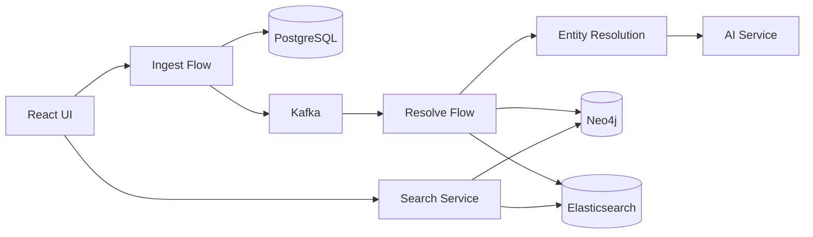

# End-to-End Data Flow Guide

This guide explains the complete data flow in the QuickBooks Business Network application, from event ingestion to entity availability in the search interface.

## Architecture Overview



## Data Flow Steps

### 1. Event Ingestion

**Endpoint:** `POST /api/v1/ingest/events`

Events enter the system through the Ingest Flow service. Each event contains:
- `type`: INVOICE, PAYMENT, VENDOR_ADD, or CUSTOMER_ADD
- `sourceBusinessRaw`: The source business name/data
- `targetBusinessRaw`: The target business (for transactions)
- `amount`: Transaction amount (optional)
- `metadata`: Additional business information (JSON)

**Storage:** Events are stored in PostgreSQL with initial status `PENDING`.

### 2. Outbox Publishing

The Ingest Flow uses the transactional outbox pattern:
1. Event is stored in `quickbooks_events` table
2. Outbox entry is created in `outbox` table
3. Background scheduler publishes outbox entries to Kafka
4. Event status is updated to `PUBLISHED`

**Kafka Topics:**
- `quickbooks.events.invoice`
- `quickbooks.events.payment`
- `quickbooks.events.vendor`
- `quickbooks.events.customer`

### 3. Event Processing (Resolve Flow)

The Resolve Flow consumes events from Kafka and:
1. Extracts business entity information
2. Calls Entity Resolution Service
3. Creates/updates nodes in Neo4j
4. Indexes documents in Elasticsearch
5. Syncs embeddings to Vector DB

### 4. Entity Resolution

The four-stage pipeline:
1. **Standardize**: Normalize names and addresses
2. **Block**: Group similar entities for comparison
3. **Compare**: Calculate similarity scores
4. **Classify**: Determine match/non-match using ML

### 5. Search Availability

Once processed, entities are available via:
- **Search Service**: `GET /api/v1/search/entities?q={query}`
- **Network Service**: Graph traversal and relationships
- **Graph RAG**: Natural language queries

## Verification Steps

### Using the UI

1. Navigate to **Data Ingestion** page
2. Submit a test event (VENDOR_ADD or CUSTOMER_ADD)
3. Go to **Flow Monitor** to track progress
4. Search for the entity in the **Search** page

### Using Scripts

**Windows:**
```powershell
# Run the unified start script (includes E2E and Topology verification)
.\scripts\start.ps1

# Or run specific specific verification scripts:
.\scripts\test-e2e-flow.ps1
.\scripts\verify_connections.ps1
```

**Linux/Mac:**
```bash
# Note: Ensure scripts are executable
./scripts/test-e2e-flow.sh
```

### Manual API Verification

```bash
# 1. Create event
curl -X POST http://localhost:8080/api/v1/ingest/events \
  -H "Content-Type: application/json" \
  -d '{"type":"VENDOR_ADD","sourceBusinessRaw":"Test Company","metadata":"{}"}'

# 2. Check metrics
curl http://localhost:8080/api/v1/ingest/metrics

# 3. Search for entity
curl "http://localhost:8080/api/v1/search/entities?q=Test+Company"
```

## Expected Timing

| Stage | Expected Time |
|-------|---------------|
| Ingest to PostgreSQL | < 100ms |
| Outbox publishing | < 1 second |
| Kafka -> Resolve Flow | < 5 seconds |
| Entity Resolution | < 100ms |
| Neo4j persistence | < 500ms |
| Elasticsearch indexing | < 5 seconds |
| **Total E2E** | **< 15 seconds** |

## Monitoring

### Metrics Endpoints

- Ingest Flow: `GET /api/v1/ingest/metrics`
- Resolve Flow: `GET /api/v1/resolve/metrics`
- Search Service: `GET /api/v1/search/metrics`

### Flow Monitor Dashboard

Access at: `http://localhost:3000/flow-monitor`

Displays real-time status of all pipeline stages with visual indicators.

## Troubleshooting

See [Troubleshooting Data Flow](../setup/troubleshooting-data-flow.md) for common issues and solutions.
